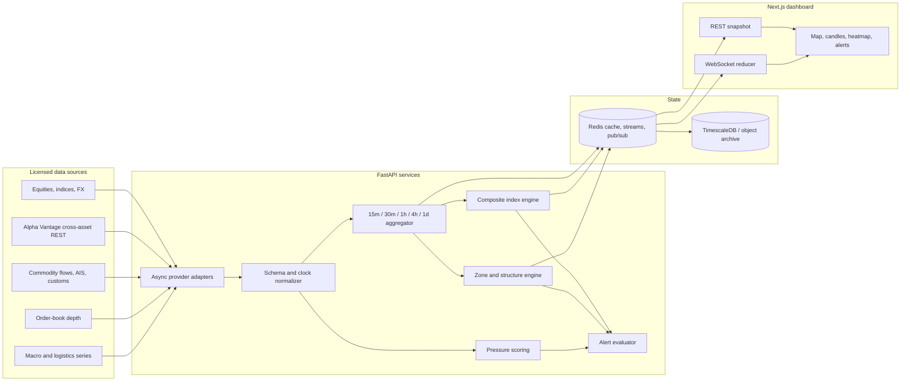

# System architecture

## Production target topology



This diagram is the production target. The checked-in reference implementation runs the same calculation stages in one FastAPI process, keeps bounded history in memory, optionally mirrors snapshots to Redis, and sends full WebSocket snapshots. TimescaleDB/object storage, replayable streams, licensed adapters, authentication, and notification delivery are explicit production seams rather than checked-in services.

The browser adapter maps the backend's snake-case/ISO wire contract into presentation contracts, so replacing the deterministic feed does not require chart-specific transport logic.

## Directory structure

```text
starterkit/
├── backend/
│   ├── app/
│   │   ├── main.py              # REST, WebSocket, and lifecycle
│   │   ├── ingestion.py         # async adapter and bar simulation
│   │   ├── alpha_vantage.py     # cross-asset live provider and cache
│   │   ├── historical.py        # CSV/JSON OHLCV parser and validator
│   │   ├── calculations.py      # composite and pressure engines
│   │   ├── zones.py             # structural zone detector
│   │   ├── alerts.py            # alert transition engine
│   │   ├── store.py             # memory cache and Redis mirror
│   │   └── domain.py            # typed market contracts
│   ├── tests/                   # domain, calculation, REST, and WS tests
│   └── requirements.txt
├── docs/
│   └── ARCHITECTURE.md
├── src/
│   ├── app/
│   │   ├── (DashboardLayout)/   # application shell and dashboard route
│   │   └── components/market/   # visual analytics components
│   └── lib/market/              # TS contracts, adapters, fixtures, calculations
└── package.json
```

## Data pipeline

1. The Alpha Vantage adapter supplies selected index, index-proxy, FX, crypto, and commodity history. It normalizes provider time zones, deduplicates concurrent requests, caches by symbol/timeframe, resamples 60-minute data into 4-hour bars, and falls back from premium intraday functions to daily data. The deterministic adapter remains the no-key/error fallback.
2. FastAPI maintains 15-minute, 30-minute, 1-hour, 4-hour, and daily component bars, calculates a normalized GMI candle for each timeframe, and excludes the active candle from zone analysis.
3. Zone, pressure, and alert engines operate on the same bounded store. Alert rules are evaluated only on their configured symbol and timeframe.
4. The in-memory store is authoritative in this reference service. Redis is an optional best-effort mirror; failures degrade to memory without stopping ingestion.
5. REST supplies symbol/timeframe history and zones. The WebSocket sends a complete snapshot on connect and on every update, so a dropped frame self-repairs.
6. A production deployment should make a replayable log authoritative, persist immutable raw and derived events to a time-series store, and switch the WebSocket to sequenced deltas plus gap recovery when payload volume warrants it.

### Historical imports

`POST /api/v1/historical/import` accepts raw UTF-8 CSV or JSON OHLCV data for any symbol and timeframe. It normalizes ISO-8601 or Unix timestamps into the same `Candle` contract used by ingestion, validates OHLC consistency, resolves duplicate timestamps as last-row-wins corrections, and atomically replaces or merges the target in-memory history. Imported symbols appear in the dashboard selector and use the existing candle, zone, and alert endpoints; they remain separate from the configured GMI component universe unless a production index-membership workflow explicitly adds them.

## Composite index methodology

Raw share prices cannot be averaged directly: their nominal scales are arbitrary. For component `i`, reference price `Pᵢ,0`, observation `Pᵢ,t`, and normalized weight `wᵢ,t`:

```text
normalizedᵢ,t = base_value × Pᵢ,t / Pᵢ,0
indexₜ        = Σ(wᵢ,t × normalizedᵢ,t)
Σwᵢ,t         = 1
```

Equal weighting uses `wᵢ = 1/N`. Market-cap weighting uses float-adjusted market cap and freezes weights for the candle to avoid look-ahead drift. Corporate actions update the reference/divisor so splits and membership changes do not create artificial returns.

- **Open:** weighted normalized component opens.
- **Close:** weighted normalized component closes.
- **High/Low (preferred):** calculate the synthetic index at aligned intrabar timestamps, then take its maximum/minimum.
- **High/Low (OHLC-only fallback):** apply the same frozen weights to normalized component highs/lows. This produces a conservative envelope and is explicitly flagged as estimated.

The user-specified “highest/lowest component” behavior is available only after normalization; using raw extrema would mix incompatible price scales.

## Zone detection

For each instrument and timeframe, the engine:

1. Measures candle body against rolling ATR and finds 2–3 consecutive directional impulse candles.
2. Walks backward to the last opposing candle in the base window.
3. Defines demand as the base body/open down to the formation wick low; supply as the formation wick high down to the base body/open.
4. Scores departure strength, freshness, trend alignment, break of structure, and a three-candle fair-value gap.
5. Counts later overlaps. A zero-overlap zone is `virgin`; tested zones are weakened, and a close through the distal boundary invalidates and removes the zone.
6. Publishes exact `proximal`, `distal`, `base_timestamp`, `impulse_start`, `impulse_end`, `timeframe`, evidence flags, and an explainable 0–100 quality score.

Zone calculations only use candles available at the evaluation timestamp. This avoids future leakage in backtests.

## Supply/demand pressure

Each sector score is a bounded `[-100, 100]` blend of normalized inputs. The
FastAPI reference service uses this five-driver subset:

```text
pressure = clip[-100,100](100 × (
  0.30 × order-book imbalance
  + 0.25 × inventory surprise (sign-adjusted)
  + 0.15 × flow / shipment impulse (sign-adjusted)
  + 0.20 × return momentum
  + 0.10 × logistics stress
))
```

The TypeScript domain layer also accepts normalized volume imbalance as a sixth
driver. Production weights belong in a versioned calculation configuration,
not transport code. Every displayed score should include freshness and coverage
so missing alternative data cannot masquerade as a neutral reading.

## Alert semantics

For current price `p` and zone interval `[low, high]`, distance is zero inside the zone; otherwise it is the gap to the nearest boundary divided by `p`. Crossing rules compare the previous and current price. Matching `(rule, zone)` events are suppressed for the configured cooldown, allowing an optional reminder if a condition persists.

Supported rules:

- configurable percentage approach threshold
- current price within a zone
- proximal or distal boundary crossing
- zone invalidation expressed as a distal crossing

## Production hardening

- Use licensed real-time feeds and keep redistribution entitlements at the WebSocket gateway.
- Run one ingestion leader per provider partition; use Redis Streams or Kafka for replayable fan-out.
- Store immutable raw events before derived data and version every calculation configuration.
- Add authentication, per-tenant watchlists, durable notification delivery, rate limits, and audit logs.
- Monitor source lag, symbol coverage, sequence gaps, correction rates, queue depth, and alert delivery latency.
- Use exchange calendars and a corporate-actions service; never infer “market open” solely from wall-clock time.
- Backtest zone rules with walk-forward evaluation and report precision/recall by asset and volatility regime.
